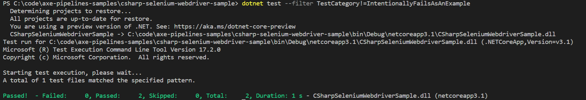
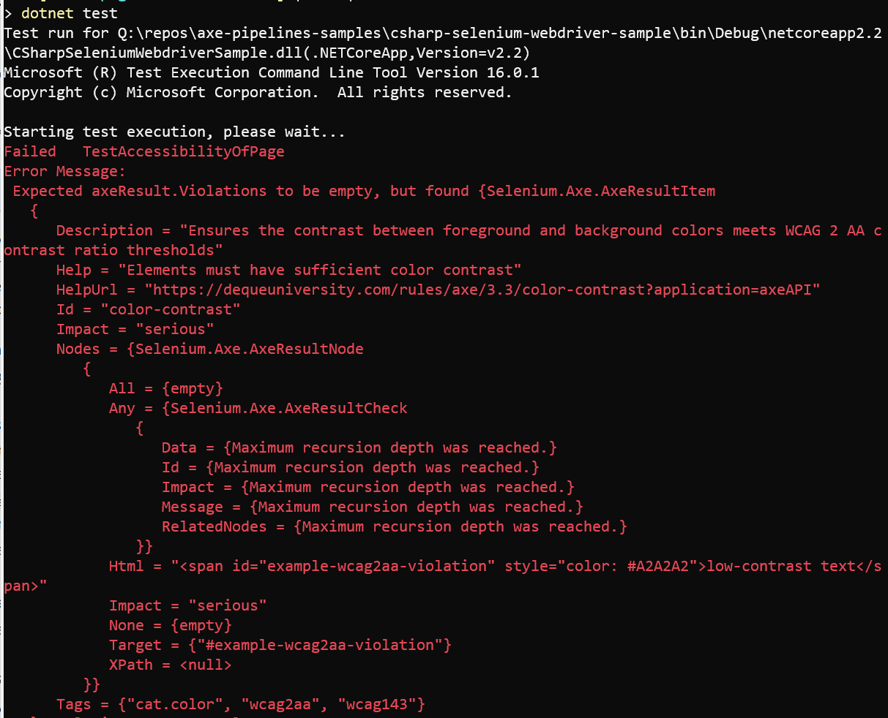
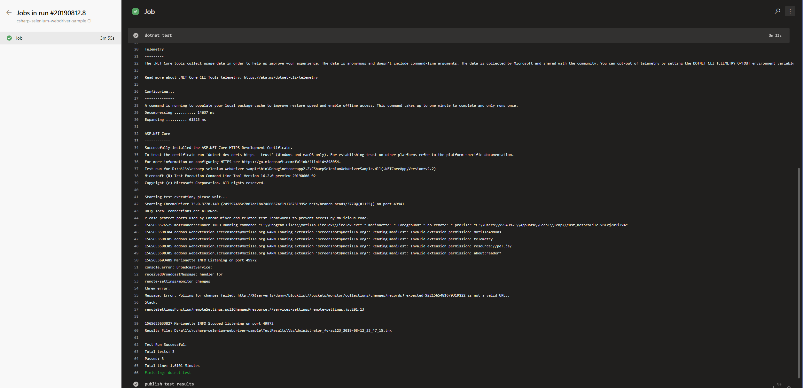

# CSharpSeleniumWebdriverSample

This sample demonstrates how you might set up a C# Project with an Azure Pipelines build that runs end to end accessibility tests in a browser.

## Getting Started

The individual files in the sample contain comments that explain the important parts of each file in context.

Some good places to start reading are:

* [SamplePageTests.cs](./SamplePageTests.cs): C# test file that opens [SamplePage.html](./SamplePage.html) in a browser with Selenium and runs accessibility scans against it
* [azure-pipelines.yml](./azure-pipelines.yml): Azure Pipelines config file that sets up our Continuous Integration and Pull Request builds

## Tools and libraries used

The key tools and libraries this sample demonstrates are:

* [Selenium.WebDriver](https://www.seleniumhq.org), the .NET library for Selenium, a tool for automating interactions with different web browsers.
* [Selenium.Axe](https://github.com/TroyWalshProf/SeleniumAxeDotnet), a .NET library for running accessibility scans on web pages by using Selenium.WebDriver to run the [axe-core](https://github.com/dequelabs/axe-core) accessibility scanning engine.
* [Azure Pipelines](https://azure.microsoft.com/en-us/services/devops/pipelines/) to run the tests in a CI build with every Pull Request.

This sample also uses a few other tools and libraries which are less important; if you use a different test framework or a different version of .NET, you can still follow along with most of the sample.

* [.NET Core](https://dotnet.microsoft.com) to build/run the code.
  * None of the libraries or C# code in the sample are specific to .NET Core; if your project uses the full .NET Framework, you can still follow along with the sample!
* [MSTest](https://github.com/microsoft/testfx) as our test framework.
  * None of the other libraries we're using require this particular framework; you can still follow along with the sample using NUnit, xUnit, or any other test framework you like.
* [Chrome](https://google.com/chrome) (with [Selenium.WebDriver.ChromeDriver](https://github.com/jsakamoto/nupkg-selenium-webdriver-chromedriver/)) and [Firefox](https://www.mozilla.org/firefox/) (with [Selenium.WebDriver.GeckoDriver](https://github.com/jsakamoto/nupkg-selenium-webdriver-geckodriver/)) as our test browsers
  * Selenium supports many different browsers and operating systems; use whichever combination is most important for your product!
* [FluentAssertions](https://fluentassertions.com/) to write test assertions
  * We like FluentAssertions because it gives great error messages out-of-the-box with Selenium.Axe. But you can still follow the rest of the sample if you prefer a different assertion style!

## See it in action on your local machine

1. Install the [.NET Core SDK](https://dotnet.microsoft.com/download)
1. Install the stable version of [Chrome](https://www.google.com/chrome/)
1. Install the stable version of [Firefox](https://www.mozilla.org/en-US/firefox/)
1. Clone this sample repository

   ```sh
   git clone https://github.com/microsoft/axe-pipelines-samples
   ```

1. Run the tests

   ```sh
   cd ./axe-pipelines-samples/csharp-selenium-webdriver-sample
   dotnet test
   ```

   

   

## See it in action in Azure Pipelines

* Example build with failures: [](https://dev.azure.com/accessibility-insights/axe-pipelines-samples/_build/latest?definitionId=33&branchName=master)
* Example build without failures: [](https://dev.azure.com/accessibility-insights/axe-pipelines-samples/_build/latest?definitionId=32&branchName=master)

<!--
  Note to maintainers: The below example images/links come from a specific build instead of the most recent build so we can link to specific tabs.
  If you update the links such that they point to a different build, make sure to mark that build as Retained so the links don't expire in a month.
-->
The accessibility tests run as part of the `dotnet test` build step:

[](https://dev.azure.com/accessibility-insights/axe-pipelines-samples/_build/results?buildId=2338&view=logs&j=12f1170f-54f2-53f3-20dd-22fc7dff55f9)

The test pass/fail results display in the Tests tab of the build logs:

[](https://dev.azure.com/accessibility-insights/axe-pipelines-samples/_build/results?buildId=2338&view=ms.vss-test-web.build-test-results-tab&runId=6512&resultId=100000&paneView=debug)
