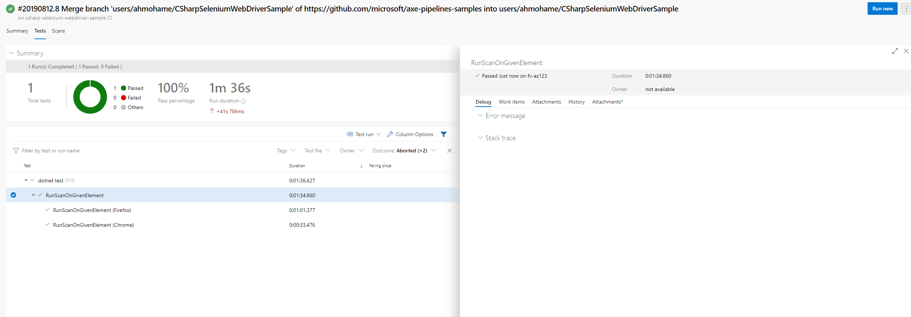

# CSharpSeleniumWebdriverSample

This sample demonstrates how you might set up a CI build for a simple, static html page to perform end to end accessibility tests in a browser.

## Getting Started

The individual files in the sample contain comments that explain the important parts of each file in context.

Some good places to start reading are:

* [SampleTest.cs](./SampleTest.cs): C# test file that opens [SamplePage.html](./SamplePage.html) in a browser with Selenium and runs accessibility scans against it with Selenium.WebDriver.ChromeDriver and Selenium.WebDriver.GeckoDriver
* [azure-pipelines.yml](./azure-pipelines.yml): Azure Pipelines config file that sets up our Continuous Integration and Pull Request builds

## Tools and libraries used

* [Microsoft.NET.Test.Sdk](https://github.com/microsoft/vstest/) to enable running tests, collect diagnostics data and report results.
* [Microsoft.NETCore.App](https://dotnet.microsoft.com) a set of .NET API's that are included in the default .NET Core application model.
* [MSTest.TestAdapter and MSTest.TestFramework](https://github.com/microsoft/testfx) MSTest V2 adapter to discover and execute MSTest Framework based tests.
* [Selenium.Axe](https://github.com/TroyWalshProf/SeleniumAxeDotnet) to run an axe accessibility scan on the page from the Selenium browser.
* [Selenium.WebDriver](https://www.seleniumhq.org) to supporting browser automation.
* [Selenium.WebDriver.ChromeDriver](https://github.com/jsakamoto/nupkg-selenium-webdriver-chromedriver/) to enable Selenium to drive Chrome.
* [Selenium.WebDriver.GeckoDriver](https://github.com/jsakamoto/nupkg-selenium-webdriver-geckodriver/) to enable Selenium to drive Firefox.
* [Azure Pipelines](https://azure.microsoft.com/en-us/services/devops/pipelines/) to run the tests in a CI build with every Pull Request.

## See it in action in Azure Pipelines

[](https://dev.azure.com/accessibility-insights/axe-pipelines-samples/_build/latest?definitionId=30&branchName=master)

<!--
  Note to maintainers: The below example images/links come from a specific build instead of the most recent build so we can link to specific tabs.
  If you update the links such that they point to a different build, make sure to mark that build as Retained so the links don't expire in a month.
-->
The accessibility tests run as part of the `dotnet test` build step:

[](https://dev.azure.com/accessibility-insights/axe-pipelines-samples/_build/results?buildId=2338&view=logs&j=12f1170f-54f2-53f3-20dd-22fc7dff55f9)

The test pass/fail results display in the Tests tab of the build logs:

[](https://dev.azure.com/accessibility-insights/axe-pipelines-samples/_build/results?buildId=2338&view=ms.vss-test-web.build-test-results-tab&runId=6512&resultId=100000&paneView=debug)

## See it in action on your local machine

1. Install the stable version of [Chrome](https://www.google.com/chrome/)
1. Install the stable version of [Firefox](https://www.mozilla.org/en-US/firefox/)
1. Clone this sample repository

   ```sh
   git clone https://github.com/microsoft/axe-pipelines-samples
   ```

1. Run the tests

   ```sh
   cd ./axe-pipelines-samples/csharp-selenium-webdriver-sample
   dotnet test
   ```

   
