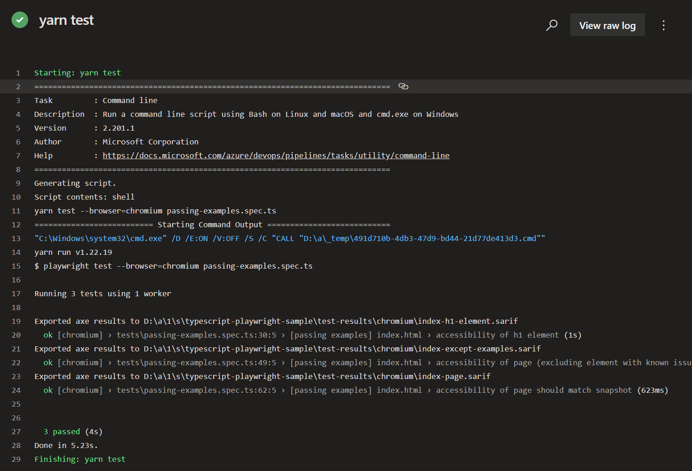
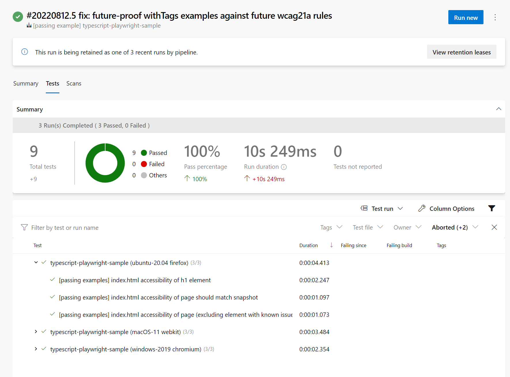
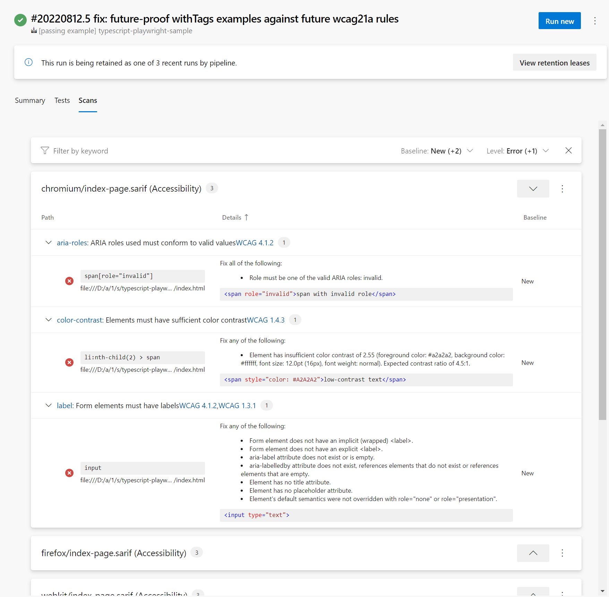
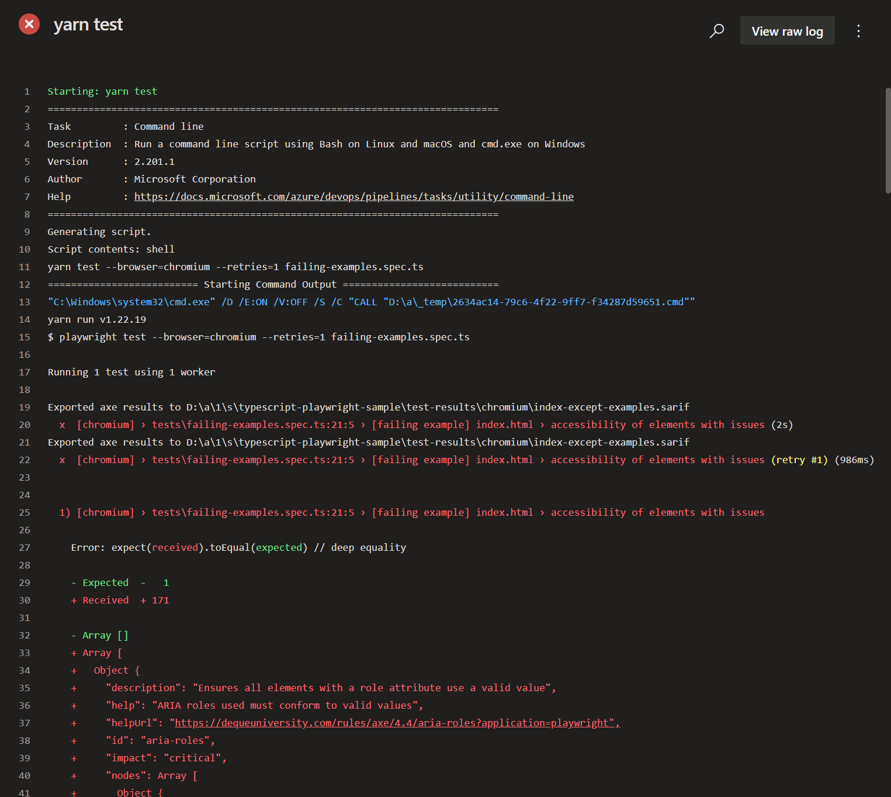
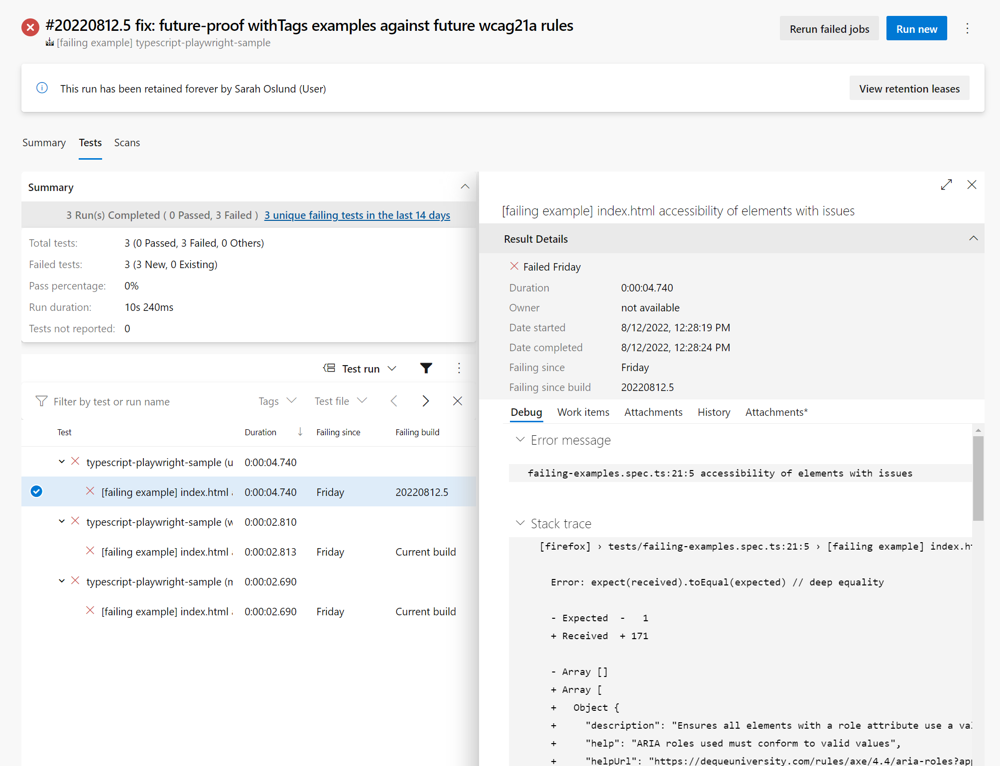
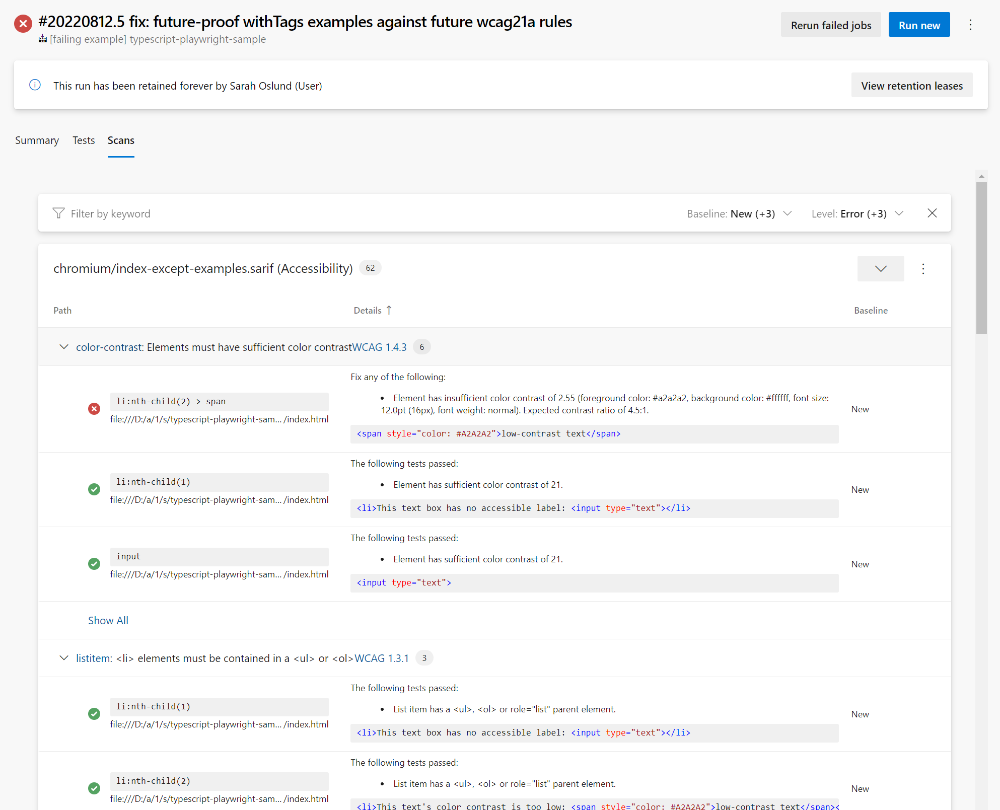
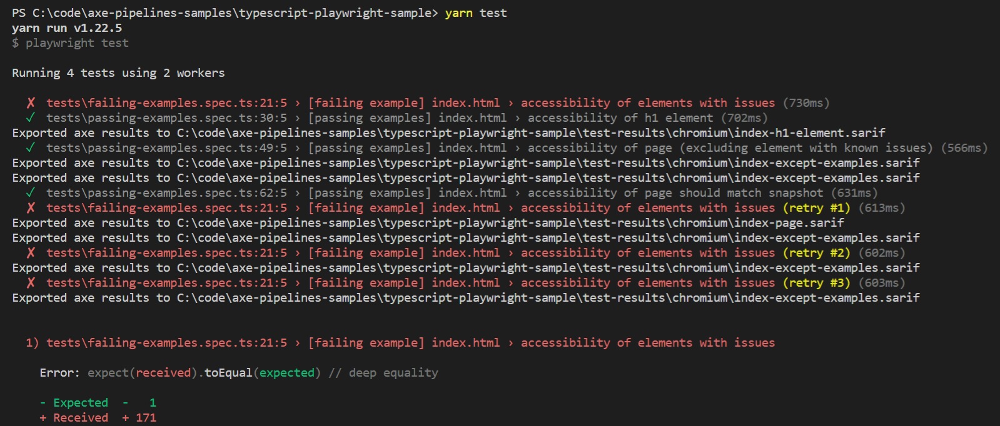

# typescript-playwright-sample

This sample demonstrates how you might set up a CI build for a simple, static html page to perform end to end accessibility tests in a browser, including how to suppress pre-existing or third-party failures. 

This sample uses [Playwright](https://playwright.dev) for browser automation and uses the corresponding `@axe-core/playwright` library to integrate Axe and Playwright. But you don't have to use Playwright to use Axe! If you prefer a different browser automation tool, you can still follow the same concepts from this sample by using the integration library appropriate for your framework:

* For **Selenium**, see our [typescript-selenium-webdriver-sample](../typescript-selenium-webdriver-sample/README.md)
* For **Puppeteer**, use [@axe-core/puppeteer](https://www.npmjs.com/package/@axe-core/puppeteer)
* For **Cypress**, use [cypress-axe](https://www.npmjs.com/package/cypress-axe)
* For **WebdriverIO**, see our [typescript-selenium-webdriver-sample](../typescript-selenium-webdriver-sample/README.md) and use [@axe-core/webdriverio](https://www.npmjs.com/package/@axe-core/webdriverio)
* For **Protractor**, see our [typescript-selenium-webdriver-sample](../typescript-selenium-webdriver-sample/README.md); keep using `@axe-core/webdriverjs` like that sample shows, but instead of creating your own Webdriver object, pass [`browser.webdriver`](https://www.protractortest.org/#/api?view=ProtractorBrowser) to `@axe-core/webdriverjs`.

## Getting Started

The individual files in the sample contain comments that explain the important parts of each file in context.

Some good places to start reading are:

* [tests/passing-examples.spec.ts](./tests/passing-examples.spec.ts): Playwright test file that opens [src/index.html](./src/index.html) in a browser with Playwright and runs accessibility scans against it with `@axe-core/playwright`
* [azure-pipelines.yml](./azure-pipelines.yml): Azure Pipelines config file that sets up our Continuous Integration and Pull Request builds
* [playwright.config.ts](./playwright.config.ts): Playwright configuration file that enables test result reporting in Azure Pipelines (using the `junit` reporter)

## Tools and libraries used

* [TypeScript](https://www.typescriptlang.org/) to author our test code
* [Playwright](https://playwright.dev/) as our test framework and browser automation library
* [@axe-core/playwright](https://github.com/dequelabs/axe-core-npm/tree/develop/packages/playwright) to run an axe accessibility scan on the page from the Playwright browser
* [Azure Pipelines](https://azure.microsoft.com/en-us/services/devops/pipelines/) to run the tests in a CI build with every Pull Request
* [axe-sarif-converter](https://github.com/microsoft/axe-sarif-converter) to convert axe results to SARIF format
* [SARIF SAST Scans Tab](https://marketplace.visualstudio.com/items?itemName=sariftools.scans) to visualize the results in Azure Pipelines

## See it in action in Azure Pipelines

<!--
  Note to maintainers: The below example images/links come from a specific build instead of the most recent build so we can link to specific tabs.
  If you update the links such that they point to a different build, make sure to mark that build as Retained so the links don't expire in a month.
-->

These two Azure Pipelines demonstrate what it looks like to incorporate passing or failing accessibility tests into your CI.

### Passing examples

[](https://dev.azure.com/accessibility-insights/axe-pipelines-samples/_build/latest?definitionId=42&branchName=main)

The passing accessibility tests included in passing-examples.spec.ts run as part of the `yarn test` build step:

[](https://dev.azure.com/accessibility-insights/axe-pipelines-samples/_build/results?buildId=39169)

The test pass results display in the Tests tab of the build logs:

[](https://dev.azure.com/accessibility-insights/axe-pipelines-samples/_build/results?buildId=39169&view=ms.vss-test-web.build-test-results-tab)

Detailed accessibility scan information also appears in the Scans tab, courtesy of the [SARIF SAST Scans Tab extension](https://marketplace.visualstudio.com/items?itemName=sariftools.scans):

[](https://dev.azure.com/accessibility-insights/axe-pipelines-samples/_build/results?buildId=39169&view=sariftools.scans.build-tab)

### Failing examples

[](https://dev.azure.com/accessibility-insights/axe-pipelines-samples/_build/latest?definitionId=43&branchName=main)

The failing accessibility tests included in failing-examples.spec.ts run as part of the `yarn test` build step:

[](https://dev.azure.com/accessibility-insights/axe-pipelines-samples/_build/results?buildId=39170)

The test pass/fail results display in the Tests tab of the build logs:

[](https://dev.azure.com/accessibility-insights/axe-pipelines-samples/_build/results?buildId=39170&view=ms.vss-test-web.build-test-results-tab)

Detailed accessibility scan information also appears in the Scans tab, courtesy of the [SARIF SAST Scans Tab extension](https://marketplace.visualstudio.com/items?itemName=sariftools.scans):

[](https://dev.azure.com/accessibility-insights/axe-pipelines-samples/_build/results?buildId=39170&view=sariftools.scans.build-tab)

## See it in action on your local machine

1. Clone this sample repository

   ```sh
   git clone https://github.com/microsoft/axe-pipelines-samples
   ```

1. Install the dependencies

   ```sh
   cd ./axe-pipelines-samples/typescript-playwright-sample
   yarn install # or npm install, whichever your project prefers
   ```

1. Run the tests!

   ```sh
   yarn test # or `npm test`. You can also append a file name to only run passing or failing tests (ex: `yarn test passing-examples.spec.ts`)
   ```

   
