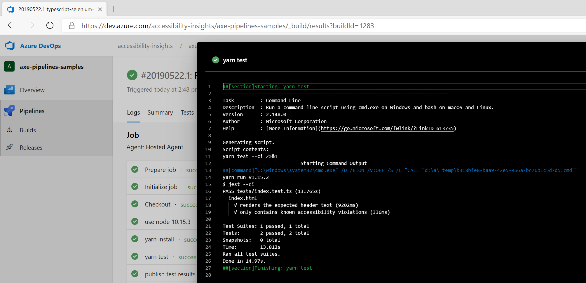
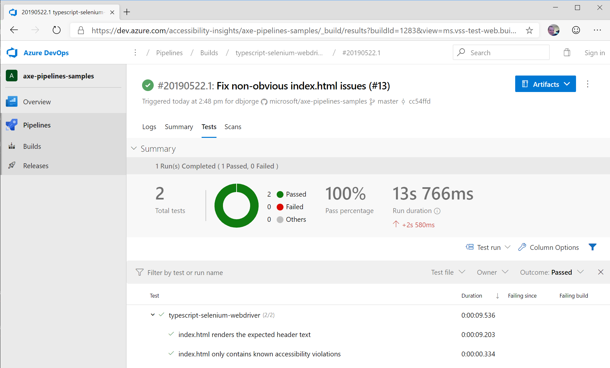
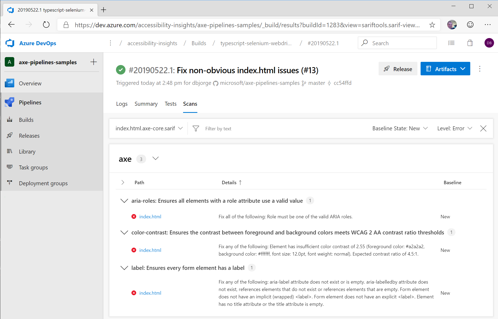
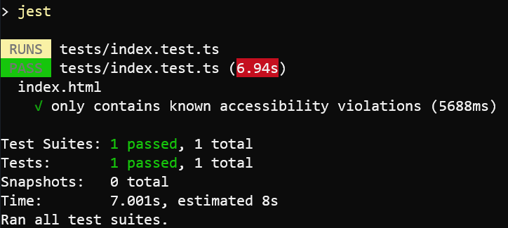

# typescript-selenium-webdriver sample

This sample demonstrates how you might set up a CI build for a simple, static html page to perform end to end accessibility tests in a browser, including how to suppress pre-existing or third-party failures using [Jest Snapshot Testing](https://jestjs.io/docs/en/snapshot-testing).

## Getting Started

The individual files in the sample contain comments that explain the important parts of each file in context.

Some good places to start reading are:

* [tests/index.test.ts](./tests/index.test.ts): Jest test file that opens [src/index.html](./src/index.html) in a browser with Selenium and runs accessibility scans against it with axe-webdriverjs
* [azure-pipelines.yml](./azure-pipelines.yml): Azure Pipelines config file that sets up our Continuous Integration and Pull Request builds
* [jest.config.js](./jest.config.js): Jest configuration file that enables TypeScript (using ts-jest) and test result reporting in Azure Pipelines (using jest-junit)

## Tools and libraries used

* [TypeScript](https://www.typescriptlang.org/) to author our test code
* [Jest](https://jestjs.io/) as our test framework, with [Jest Snapshot Testing](https://jestjs.io/docs/en/snapshot-testing) for baselining and [ts-jest](https://www.npmjs.com/package/ts-jest) for TypeScript support
* [selenium-webdriver](https://www.npmjs.com/package/selenium-webdriver) to automate browsing to the page from the tests
* [axe-webdriverjs](https://github.com/dequelabs/axe-webdriverjs) to run an axe accessibility scan on the page from the Selenium browser
* [Azure Pipelines](https://azure.microsoft.com/en-us/services/devops/pipelines/) to run the tests in a CI build with every Pull Request
* [axe-sarif-converter](https://github.com/microsoft/axe-sarif-converter) and [Sarif Viewer Build Tab](https://marketplace.visualstudio.com/items?itemName=sariftools.sarif-viewer-build-tab) to visualize the results in Azure Pipelines

## See it in action in Azure Pipelines

[](https://dev.azure.com/accessibility-insights/axe-pipelines-samples/_build/latest?definitionId=25&branchName=master)

<!--
  Note to maintainers: The below example images/links come from a specific build instead of the most recent build so we can link to specific tabs.
  If you update the links such that they point to a different build, make sure to mark that build as Retained so the links don't expire in a month.
-->
The accessibility tests run as part of the `yarn test` build step:

[](https://dev.azure.com/accessibility-insights/axe-pipelines-samples/_build/results?buildId=1283)

The test pass/fail results display in the Tests tab of the build logs:

[](https://dev.azure.com/accessibility-insights/axe-pipelines-samples/_build/results?buildId=1283&view=ms.vss-test-web.build-test-results-tab)

Detailed accessibliity scan information also appears in the Scans tab, courtesy of the [Sarif Viewer Build Tab extension](https://marketplace.visualstudio.com/items?itemName=sariftools.sarif-viewer-build-tab):

[](https://dev.azure.com/accessibility-insights/axe-pipelines-samples/_build/results?buildId=1283&view=sariftools.sarif-viewer-build-tab.sariftools.sarif-viewer-build-tab)

## See it in action on your local machine

1. Install [Chrome](https://www.google.com/chrome/) and [ChromeDriver](http://chromedriver.chromium.org/getting-started), and make sure ChromeDriver is on your PATH.
1. Clone this sample repository

   ```sh
   git clone https://github.com/microsoft/axe-pipelines-samples
   ```

1. Install the dependencies

   ```sh
   cd ./axe-pipelines-samples/typescript-selenium-webdriver
   yarn install # or npm install, whichever your project prefers
   ```

1. Run the tests!

   ```sh
   yarn test # or npm test
   ```

   
